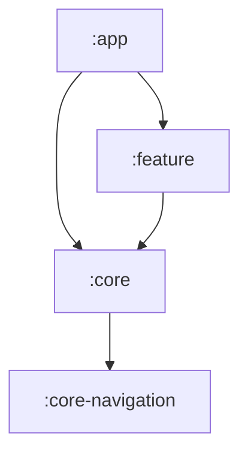

# [Steam Thresher] (https://en.wikipedia.org/wiki/Threshing_machine)

PoC for https://liftago.atlassian.net/browse/LTG-18055 and https://liftago.atlassian.net/browse/LTG-18097

## Module Architecture
The modules architecture is based on this model:

### :core-navigation
`:core-navigation` module defines the basic structure of `Navigator`, `Action`, `Args` and 
`ActionDelegate`. The types other modules will depend on when navigating. 
On the inner level it also implements notification to action transformation.

This module is meant to be only propagated by the `:core` as it serves no real purpose on its own.

### :core
This module provides a basic implementation of `:core-navigation` interfaces (especially in `blocks`
package). And further defines more granular structures such as `ActionHandler`.
`:core` module is also a host for the actual `Action` and `Args` implementations.

This module suppose to provide generic navigation implementation for `:app` module as well as well
as for `:feature` modules, that needs to implement the `NavHostFragment` (or its extensions).
It also provides a knowledge of what `Actions` this app is capable and what are the required 
arguments of it. Thus this module can be used in every `:feature` module, giving the flexibility of 
features to navigate to other features without exact knowledge how they are implemented.

> It's also worth to mention that while `Navigator` can be used to navigate to other features, it 
> should be used for the navigation within the module as well. So any view should not change 
> internal >state of the feature module directly, but rather through `Navigator` with **Top-Bottom** 
> breakdown. This is also known as [**unidirectional data flow**] (https://en.wikipedia.org/wiki/Unidirectional_Data_Flow_(computer_science)) 

### :feature
Is the actual place, where all the business related code should sit. Apart from a specifics to 
implementation of the `NavHostFragmet`, there are no restrictions.

From the dependency perspective this **must** depend on the `:core`.

### :app
The last module that defines how to put all previous together. It gives the actual implementations 
of all the abstraction from `:core`, `:core-navigation` and `:feature` and connects them to one 
functional unit, the Application. No business logic should be presented here, but there might be 
a time when this will be required for the `MapActivity` and `EmptyActivity` based on the feature 
needs. The main purpose is to connect things and point them to right location, so this module
is responsible for choosing the activity (via `ActionDelegate`) as well as for the fragment 
(via `ActionHandler`).

This module depends on all other modules and others **must not** depend on `:app`!!!
