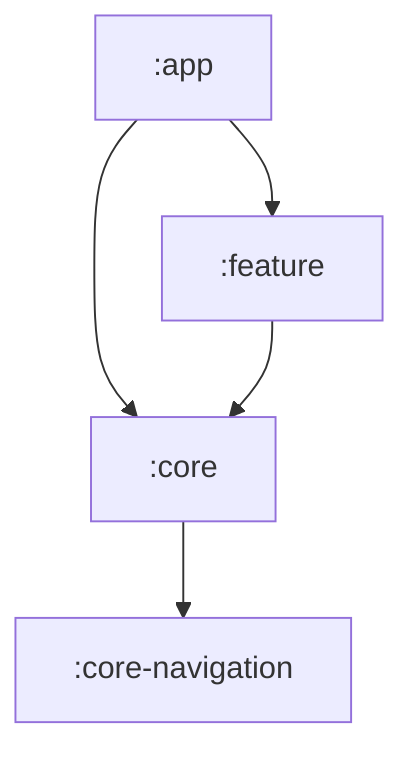
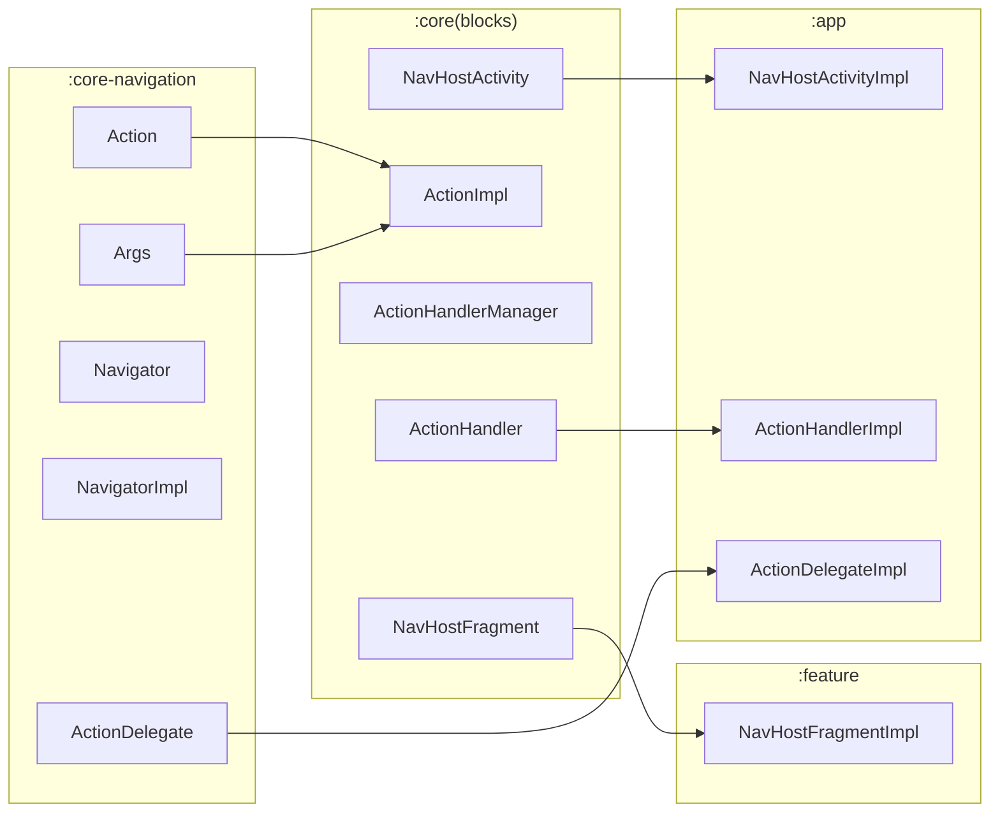
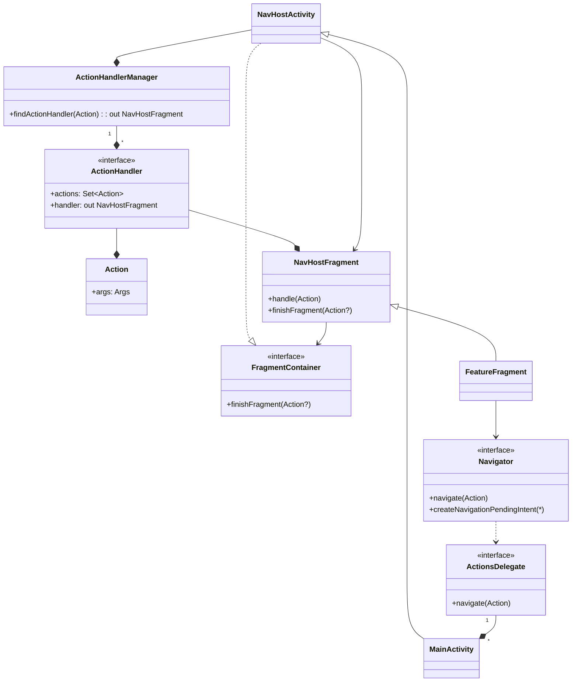

# Steam Thresher ([wiki](https://en.wikipedia.org/wiki/Threshing_machine))

PoC for https://liftago.atlassian.net/browse/LTG-18055 and https://liftago.atlassian.net/browse/LTG-18097

The main idea of this architecture is to create layered navigation that will allow to use compose 
world's Single Activity approach, but also won't require to necessarily convert everything to 
compose just yet. The fragments in this solution serves mainly as loose coupled containers that 
communicates with the rest of the app through `Navigator`. That further supports the unidirectional 
data flow, that is base of the compose world.

## Modules
The modules architecture is based on this model:



### `:core-navigation`
`:core-navigation` module defines the basic structure of `Navigator`, `Action`, `Args` and 
`ActionDelegate`. The types other modules will depend on when navigating. 
On the inner level it also implements notification to action transformation.

This module is meant to be only propagated by the `:core` as it serves no real purpose on its own.

### `:core`
This module provides a basic implementation of `:core-navigation` interfaces (especially in `blocks`
package). And further defines more granular structures such as `ActionHandler`.
`:core` module is also a host for the actual `Action` and `Args` implementations.

This module suppose to provide generic navigation implementation for `:app` module as well as well
as for `:feature` modules, that needs to implement the `NavHostFragment` (or its extensions).
It also provides a knowledge of what `Actions` this app is capable and what are the required 
`Args`. Thus this module can be used in every `:feature` module, giving the flexibility for 
features to navigate to other features without exact knowledge how they are implemented.
So while `:feature` holds a secrets of the implementation, the `Action` definitions in `:core` are
completely public for anyone.

> It's also worth to mention that while `Navigator` can be used to navigate to other features, it 
> should be used for the navigation within the module as well. So any view should not change 
> internal state of the feature module directly, but rather through `Navigator` with **Top-Bottom** 
> breakdown. This is also known as [**unidirectional data flow**](https://en.wikipedia.org/wiki/Unidirectional_Data_Flow_(computer_science)) 

### `:feature`
Is the actual place, where all the business related code should sit. Apart from a requirement to 
implement the `NavHostFragmet`, there are no other restrictions.

From the dependency perspective this **must** depend on the `:core`.

### `:app`
The last module that defines how to put everything together. It gives the actual implementations 
of all the abstraction from `:core`, `:core-navigation` and `:feature` and connects them to one 
functional unit, the Application. No business logic should be presented here. The main purpose is 
to connect things and point them to right location, so this module is responsible for choosing the
actual consumer (via `ActionDelegate`) as well as for the exact fragment (via `ActionHandler`) when
the UI navigation should be handled by `NavHostActivity` implemented in this module.

This module depends on all other modules and **others must not** depend on `:app`!

#### API extension breakdown
Following graph illustrates the high level hierarchy of modules implementing api from other modules.


## Blocks
Simplified view of the building blocks and its hierarchy & relations are displayed below:


### `Navigator`
Is the core api of the solution. It serves as a accessor for `Action`s producers. It also allows to
create `PendingIntent` for notification purposes it will then consume and automatically navigate
when fired.

### `Action` & `Args`
Are another core apis, defining what suppose to be done and what params are required for that.
It isn't functional, the action definition is by existence (unlike the UseCase way). Thus name
should contain short and descriptive sentence of what it suppose to do (`OpenRoutePlannerAction`, 
`StartBroadcastAction`, etc.)

Args supports the need of passing ids, etc. The requirement for both `Action` and `Args` is they 
have to be `@Parcelable` since they are passed through intents. Technically it can hold any object
if needed. But it's not really recommended.

> This concept is mostly logical and trying to be type-safe. If you think about it more in-dept,
> you'll notice, the both `Action` and `Args` are somewhat the same thing.
> It might be tempting to confuse this two patterns then:
> ```kotlin
> @Parcelize
> sealed class DetailType : Args() {
>   data class Taxi(val id: Int): DetailType
>   data class Delivery(val id: Int): DetailType
> }
> 
> @Parcelize
> class OpenDetailAction(args: DetailType) : Action<DetailType>(args)
> ```
> vs
> ```kotlin
> @Parcelize
> data class IdArgs(val id: Int) : Args
> 
> @Parcelize
> class OpenTaxiDetailAction(args: IdArgs) : Action<IdArgs>(args)
> class OpenDeliveryDetailAction(args: IdArgs) : Action<IdArgs>(args)
>```
> They represent the same thing. Neither one is wrong. Both have its uses and it depends case by 
> case. That might be a good lead which to choose is the alignment with implementation.
> If there is only tiny difference and it will be always handled from one module, both are ok.
> But if there is a chance of having both implementations in different modules, the 1st option would
> be too tight, and also demanding Taxi impl to know there is an `DetailType.Delivery` as this is 
> automatically propagated from the sealed class. So the 2nd approach is more flexible, but also 
> generates a lot of actions. The 1st is likely a perfect option for flows with multiple steps.

### `ActionHandler`
Interface for determining `NavHostFragment` -- the receiver of the `Action`. There is a
restriction that `Action` can be presented in exactly one `ActionHandler`. If two fragments wants to
implement the same functionality, it must be defined as two different actions. On the other hand, 
it's not a problem to have `NavHostFragment` in multiple `ActionHandler`s though. (Depends if the 
`ActionHandler` represents logical group of actions or abilities of one `NavHostFragment`. Neither
one is wrong.) 

> `ActionHandler` is defined in `:core` module (not in `:core-navigation`) intentionally. It's 
> existence is required only by `NavHostActivity` to find a correct `NavHostFragment` with required 
> `Action`. Focused read could notice, the `Action` is generic object, not tied to `Navigation` in 
> any way (only used). This implies existence of `Action`s that will not be have any UI, thus won't
> be contained in any `ActionHandler`.

### `ActionsDelegate`
Is an interface defined in `:core-navigation` module and implemented within `:app` module. It's 
purpose is kinda back door to allow navigating to `Action`s that does not have `ActionHandler`.
It might be used for starting Activities, that do not implement `NavHostActivity` and live on its
own. In other words, the Android's settings intent can be navigated like that.

> You might have noticed, this does not contain any `Nav` naming. The `Action` is completely generic 
> object. Only the usage of `Action` with `ActionHandler` making it navigating to UI. But the 
> concept is a way broader. It's meant to comply with MVI architecture, by allowing `Action` to be 
> consumed by non-UI handler, modify data, which might end up in repository data emit, that the UI
> is already attached to.

### `ActionHandlersManager`
Consolidates `ActionHandler`s into one searchable component used by the `NavHostActivity` for 
starting handling fragments and managing their lifecycle.

### `NavHostActivity`
Contains the functionality around navigation. The base concept is fragments used through 
`FragmentManager`. And also `launchMode="singleInstance"` in the Manifest as the core of the 
functionality is based on `onNewIntent`'s receive of navigation `Action`s. The whole concept will be 
explained more in depth later.

### `FragmentContainer`
Mimics the basic behaviour of `Activity` and `startActivityForResult`. Most of the fragments will
be used as a part of stateful flows and thus there must be always `back` & `forward` ways. While the
`Navigator` is the forward navigator only (!by implementation, not by concept!), the complement is
the `FragmentContainer`. `finishFragment` without action is simple 'back'. With action it's 
`replace` or `popUpTo` depending if the `Action`'s handler is somewhere in the backstack already.

### `NavHostFragment`
Serves the role of UI host container. The only thing is to implement method `handle(Action)` by
update of the UI based on navigation args. For legacy code, this is likely to be invoked only once.
For newer screens there is also `NavHostComposeFragment` that requires implementing class to provide
`@Composable` method (once) and pass the `StateFlow<Action>` that can be used in compose normally.
For most cases, this would be the place, where the `Action` should be transformed to some compose 
`NavHostController` and implement it's own stack. 

## Hilt
The whole project uses hilt for DI. But at the same time DI is just used, it doesn't need to be Hilt
but it has to support base nav schema of this solution through [SavedStateHandle](https://developer.android.com/training/dependency-injection/hilt-jetpack#viewmodels).
Apart from that no restrictions on DI are established. The Hilt was chosen because it plays nicely 
with compose and is able to do VM automatically. It also provides compile-time safety.

> Former architecture relies on `@Assisted` VM's, which is somewhat not really suitable approach. 
> We want VM's to be persisted, reused if possible, so this should be driven by some Fragment 
> Arguments, not really some other objects. Since the Fragments now parametrizes the VM's through
> SavedStateHandle, there is no real need for VM.Factory patterns.
> Although historically there will be a case since the Fragments might be functional from legacy 
> pov. But if the aim is to go to Compose+VM, fragments will be only hosts of the Screen, not even 
> providing the VM's directly as that can be done in @Compose already. Thus @VM.Factory is somewhat
> deprecated for this architecture already.

## Principles
It was already mentioned, this architecture goes way beyond just UI navigation, but touches also 
some MVI functionality to support the case. 

`ActionDelegate` provides an `Action` consumer. From it's nature, it's not restricted to UI, and 
can provide any kind of handler. **`NavHostActivity` is the first implementation of the 
`ActionDelegate` that consumes actions by displaying UI**. 

### Unidirectional flow
This is a core principle, to always use `Navigator` and `Action` even for things that could be 
handled locally within a `NavHostFragment`. This will allow to follow a Single responsibility 
principle. But will be also beneficial for things like automatic logging or tracking with unified
approach. Giving the ability to easily reproduce user's faulty flow by replicating the stack.

### Forward and backward navigation (`NavHostActivity`perspective)
The regular navigation implementations has many args like `pop`, `launchSingleTop` and so on.
This project contains `Navigator` that accepts only `Action`s. No params like these can be found, 
instead all of this functionality is replicable by choosing the correct blocks and strategy.

#### RootAction
Is a marker interface, that is the only exception, when `Action` can denote some information for 
`NavHostActivity`. It means to clear the back stack and it's purpose is justified by server being
the only true source of truth. Which means there might be situation, when app is restored from 
recents, but it's view hierarchy does not comply with the state obtained from server. In that case 
the `RootAction` suppose to be used to 'restart' application's ui stack.

> Do not create other marker interfaces for things like this. It's not justified by any means.
> If the `DataAction` split will be required, it would be better to split `Action` for `NavAction`
> consumed by `NavHostActivity` only and then `DataAction` for non-UI consumptions.

#### Forward `Navigator`
The consumption of `Navigator` in `NavHostActivity` denotes that the use case is forward only. This 
means any new action passed into `Navigator` ends up by adding current fragment to backStack in 
`NavHostActivity`. If the consuming `NavHostFragment` is on top, it receives the new `Action` by 
appropriate method. There is no way how to 'undo' an `Action` from `Navigator`. The `Action` is 
consumed and cannot be reverted. Instead there is an 'Backward' way to be used.

> You might noticed that there is a backStack of `NavHostFragment`s, but if one fragment received
> second `Action` it won't navigate to first if back is pressed. In that case another 
> `NavHostFragment` has to be used, to present the consumer of Action in the back stack hierarchy.

#### Backward `FragmentContainer.finishFragment()`
Complementary to `Navigator`'s `navigate(Action)` there is the `FragmentContainer` and its  
`finishFragment(Action?)` method. It works similarly, but differently. This interface is 
implemented by the `NavHostActivity` that uses it only internally (thus its also available only 
within `NavHostFragment` as it's entirely for the UI only). The difference is, that apart from 
`navigate` this allows `NavHostFragment` to tell the `NavHostActivity` that it suppose to pop 
current fragment. It can then use the provided Action (if provided) to navigate elsewhere.

> This is kind of goes against unidirectional principle as not all actions goes through `Navigator`.
> On the other hand, this is also UI only thus shouldn't be in the `Navigator` either.
> So definitely place for future improvements if required.

### Animations
Only supported animations are fragment transitions. Unfortunately they kind of doesn't work when
navigating from/to compose implementation. Not really sure where the issue lies. When this was
attempted to reproduce for reporting to google, it did work on the sample project correctly, so it
should be doable, although buggy right now.

## How to start?
TODO
